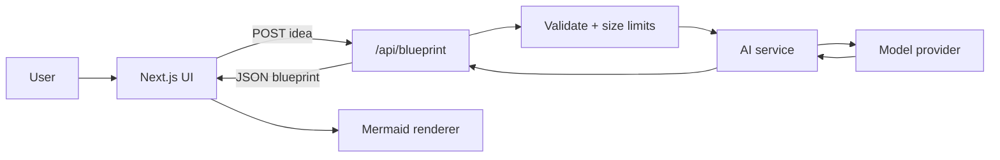

# Architecture

## System overview

BluePrint is a **modular monolith**: one Next.js application that both renders the UI and calls the model. There is no database, auth service, or worker queue. A blueprint exists only in the current browser session.



## Components

| Component | Path | Responsibility |
| --- | --- | --- |
| Idea form | `src/components/` | Capture a short product idea; enforce length limits |
| Blueprint view | `src/components/` | Render architecture, tech, diagram, roadmap; loading/error/empty/outage states |
| Route handler | `src/app/api/blueprint/route.ts` | Validate input, call the AI provider, return typed JSON |
| AI abstraction | `src/lib/ai/` | `AIProvider` interface, factory, Gemini primary, Cerebras → Groq → Hugging Face → OpenRouter failover |
| Schemas | `src/lib/schemas/blueprint.ts`, `idea.ts` | Zod schemas — source of truth for the `Blueprint` type and request validation |
| Types | `src/types/blueprint.ts` | Re-exports the `Blueprint` type inferred from the schema |
| Prompts | `src/prompts/` | System prompt that instructs the model to return the `Blueprint` JSON shape |
| Mock data | `src/lib/utils/mockBlueprint.ts` | Realistic fixture for building the UI before AI is wired up |

## Project structure

```text
src/
├── app/            # Routes: `/` landing, `/create` generator, `api/blueprint`
├── components/     # Idea form, results view, Mermaid renderer
├── lib/
│   ├── ai/
│   │   ├── types.ts      # AIProvider interface, config, error types
│   │   ├── config.ts     # Env: AI_PROVIDER, GEMINI_*, CEREBRAS_*, GROQ_*, HF_*, OPENROUTER_*
│   │   ├── provider.ts   # Factory (Gemini default, ordered fallbacks)
│   │   ├── openrouter-catalog.ts  # Free-model discovery, ranking, cache
│   │   ├── openrouter-health.ts   # Process-local known-good / unhealthy registries
│   │   └── providers/    # gemini.ts, cerebras.ts, groq.ts, huggingface.ts, openrouter.ts
│   ├── schemas/
│   │   ├── blueprint.ts  # Zod schema — Blueprint source of truth, types inferred via z.infer
│   │   └── idea.ts       # Request validation for POST /api/blueprint
│   └── utils/
│       └── mockBlueprint.ts  # Realistic fixture data
├── prompts/        # System/user prompts, kept out of UI and lib/ai
├── types/          # Blueprint type, re-exported from lib/schemas
└── docs/           # Architecture, roadmap, decisions
```

Path aliases (`tsconfig.json`): `@/app/*`, `@/components/*`, `@/lib/*`, `@/prompts/*`, `@/types/*`, plus a general `@/*`.

## Data flow

1. User submits an idea (plain text).
2. Client `POST`s `{ idea: string }` to `/api/blueprint`, validated by `src/lib/schemas/idea.ts`.
3. Route handler rejects empty, oversized, or malformed payloads.
4. Route handler calls an `AIProvider` (`src/lib/ai/types.ts`, created via `src/lib/ai/provider.ts`), which sends the idea plus the blueprint prompt (`src/prompts`) and must return data validated against `blueprintSchema` (`src/lib/schemas/blueprint.ts`) — the same schema the `Blueprint` type is inferred from:

```ts
interface Blueprint {
  architecture: string;
  architectureReasoning: string;
  techStack: {
    frontend: string;
    backend: string;
    database: string;
    hosting: string;
  };
  diagram: string; // Mermaid source
  roadmap: {
    week1: string[];
    week2: string[];
    week3: string[];
    week4: string[];
  };
}
```

5. Client renders `architecture`, `architectureReasoning`, `techStack`, and `roadmap` as text/lists, and passes `diagram` to a client-only Mermaid renderer.
6. If every configured provider fails for a transient/availability reason (rate limit, timeout, network, 5xx, or optional-provider 402), `POST /api/blueprint` returns **HTTP 503** with `{ "error": "AI_SERVICE_UNAVAILABLE" }`. The UI shows a dedicated outage state. Invalid JSON, schema validation, and config errors keep the existing error path.
7. Refresh or close tab discards the result (no storage).

## Integrations

- **Model provider** through the `AIProvider` interface. Default is Gemini (`@google/genai` Interactions API, `GEMINI_API_KEY`). Optional fallbacks, in order: Cerebras (`CEREBRAS_API_KEY`), Groq (`GROQ_API_KEY`), Hugging Face Inference Providers (`HF_TOKEN`), OpenRouter (`OPENROUTER_API_KEY`, free catalog, max three models). Unconfigured keys skip that step. API keys stay on the server.
- **Mermaid** in the browser only. The model returns structured architecture data, not an image. The client generates Mermaid from that data.

No GitHub, payments, email, or object storage in the MVP.

## Security

- Secrets only in server env (`GEMINI_API_KEY`, `CEREBRAS_API_KEY`, `GROQ_API_KEY`, `HF_TOKEN`, `OPENROUTER_API_KEY`).
- Treat idea text as untrusted: length cap, no eval, sanitize nothing into HTML except via React text nodes; Mermaid render in a constrained component.
- Do not log full prompts with user ideas in production if they may contain sensitive content.
- Optional later: coarse in-memory rate limit on the route. Not required to demo.

## Deployment

Single Next.js process. Horizontal scale is optional; the bottleneck is the model latency budget (~30s useful result). No migrations.

## Architectural decisions

See [DECISIONS.md](./DECISIONS.md).
